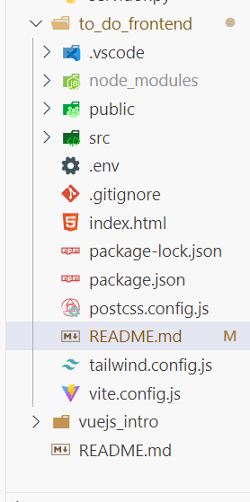
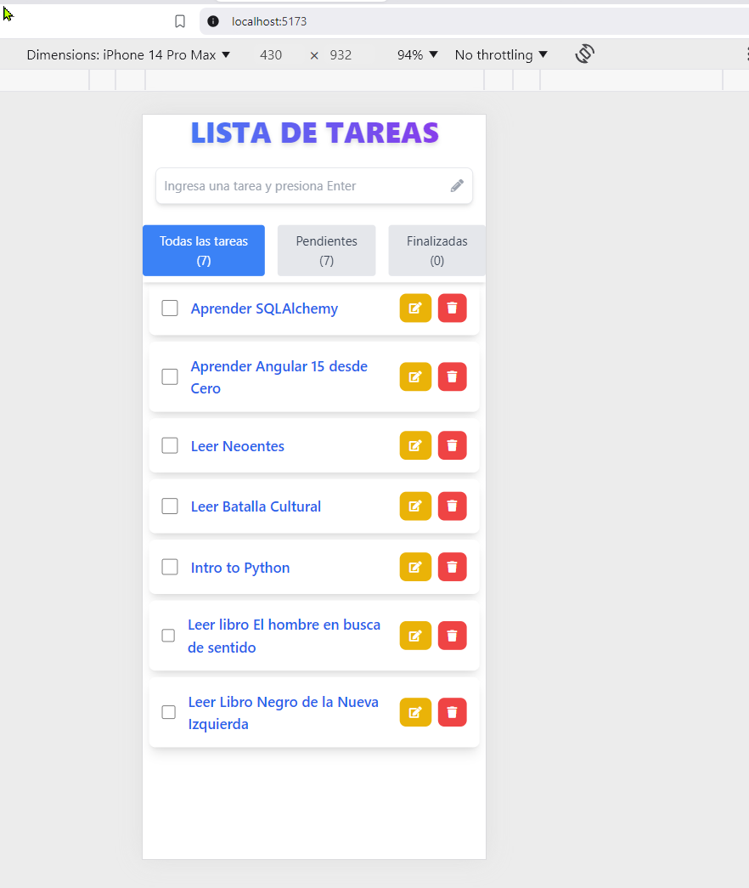
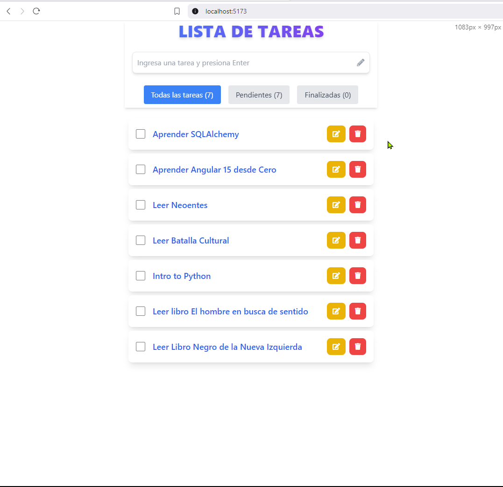
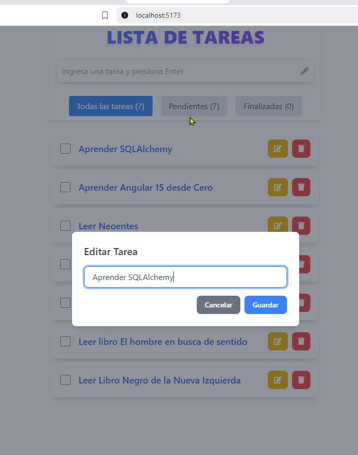
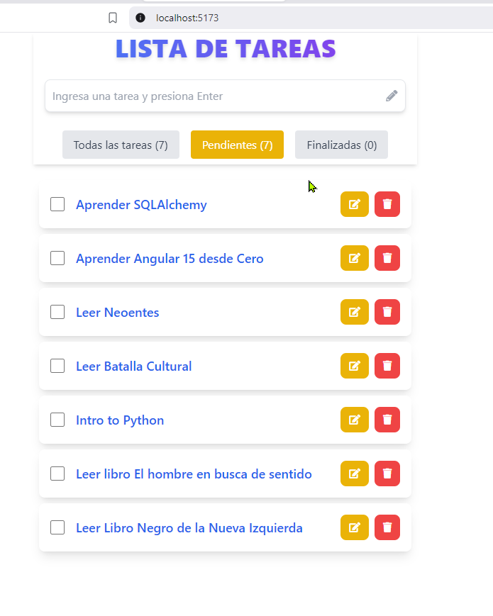
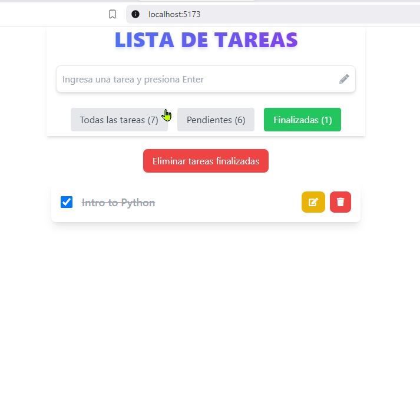

# Lista de Tareas - Frontend

Esta es una aplicación de lista de tareas desarrollada con **Vue.js 3**, **Vite**, y **TailwindCSS**. Permite a los usuarios gestionar tareas pendientes con funcionalidades para agregar, editar, eliminar y marcar como completadas.

---

## Descripción del Proyecto

El proyecto está diseñado para:
- Crear tareas pendientes.
- Editar y eliminar tareas existentes.
- Filtrar tareas por estado: Todas, Pendientes y Finalizadas.

---

## Tecnologías Utilizadas

- **Vue.js 3**
- **Vite**
- **TailwindCSS**
- **Font Awesome** para iconos

---

## Requisitos Previos

Asegúrate de tener instalado **Node.js** y **npm** en tu sistema. Puedes verificarlo ejecutando:

```bash
node --version
npm --version
```

Si no está instalado, descárgalo desde [nodejs.org](https://nodejs.org/).

---

## Instalación

1. Clona este repositorio:

```bash
git clone https://github.com/Fhernd/proy08_to_do_vuejs.git
cd lista-de-tareas-frontend
```

2. Instala las dependencias:

```bash
npm install
```

3. Inicia el servidor de desarrollo:

```bash
npm run dev
```

4. Abre tu navegador web y accede a [http://localhost:5173](http://localhost:5173).

---

## Funcionalidades

### 1. Agregar una Tarea
- Ingresa el texto de la tarea en el campo superior y presiona **Enter**.
- La tarea será añadida automáticamente a la lista de tareas pendientes.

### 2. Editar una Tarea
- Haz clic en el ícono de edición  para modificar el texto de la tarea.

### 3. Eliminar una Tarea
- Haz clic en el ícono de eliminar  para borrar una tarea.

### 4. Filtrar Tareas
- Filtra tareas por estado usando los botones:
  - **Todas las tareas**
  - **Pendientes**
  - **Finalizadas**

### 5. Marcar como Completada
- Haz clic en la casilla de verificación para marcar una tarea como completada.

---

## Vista Previa

### Estructura de archivos y carpetas


### Vista general móvil


### Vista general escritorio


### Edición de una tarea


### Tareas pendientes


### Tareas finalizadas


---

## Autor

Creado por John Ortiz Ordoñez - johnortizo@outlook.com

**Repositorio en GitHub:** [Enlace al repositorio](https://github.com/Fhernd/proy08_to_do_vuejs)
